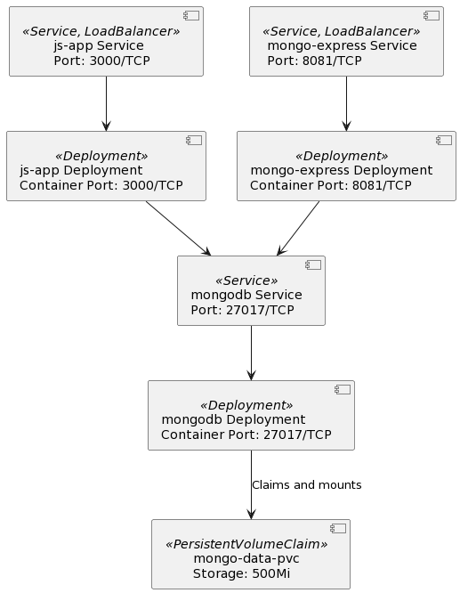

# Hurtig demo for Kamstrup DevOps Engineer rolle
## Byg image fra Dockerfile og push til image 
### Lokal
- Byg image med `docker build -t app:latest .`

### Remote Image Registry - Dockerhub
- Byg image med `docker build -t kevork/app:1.x .`
- Push image `docker push kevork/app:1.x`

### Start med docker-compose
- `docker-compose up` eller detached med `docker-compose up -d`

# Rough Kubernetes Diagram

# Kør på Kubernetes
- Hvis på Minikube på docker, så husk `minikube start --kubernetes-version=v1.27.4 --vm-driver=docker`
- Apply K8s manifest `kubectl apply -f k8s-manifest.yaml`
- For at åbne hjemmesiden, kræver Minikube at man laver en tunnel med `minikube service js-app`
- For at åbne mongo-express: `minikube service mongo-express`
